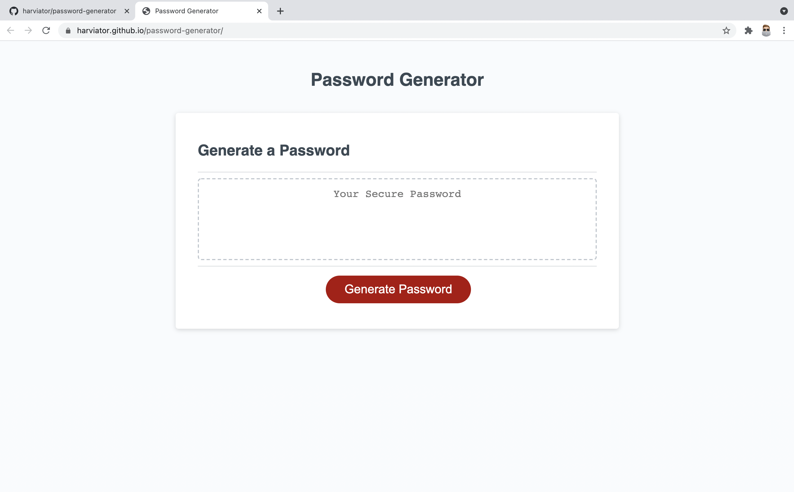

# JavaScript: Password Generator

## Background
This is the third homework assignment for the UofT Bootcamp.  Below is the story and acceptance criteria for reference.

## User Story

```
AS AN employee with access to sensitive data
I WANT to randomly generate a password that meets certain criteria
SO THAT I can create a strong password that provides greater security
```

## Acceptance Criteria

```
GIVEN I need a new, secure password
WHEN I click the button to generate a password
THEN I am presented with a series of prompts for password criteria
WHEN prompted for password criteria
THEN I select which criteria to include in the password
WHEN prompted for the length of the password
THEN I choose a length of at least 8 characters and no more than 128 characters
WHEN prompted for character types to include in the password
THEN I choose lowercase, uppercase, numeric, and/or special characters
WHEN I answer each prompt
THEN my input should be validated and at least one character type should be selected
WHEN all prompts are answered
THEN a password is generated that matches the selected criteria
WHEN the password is generated
THEN the password is either displayed in an alert or written to the page
```

## Process
* The code for html and css were already given as well as the skeleton of the JavaScript
* I started with creating arrays with the characters for the password
* Next looked at how to randomize the array and concat them
* The next step was to put the arrays into a password object
* After the arrays were in an object I added the prompts, alerts, if statements, and a for loop to put the password together to meet the criteria
* Finally, I added it all to the skeleton of the JavaScript that was provided

## Screen Shot


## Link
https://harviator.github.io/password-generator/